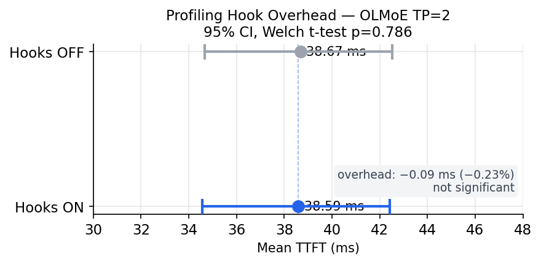
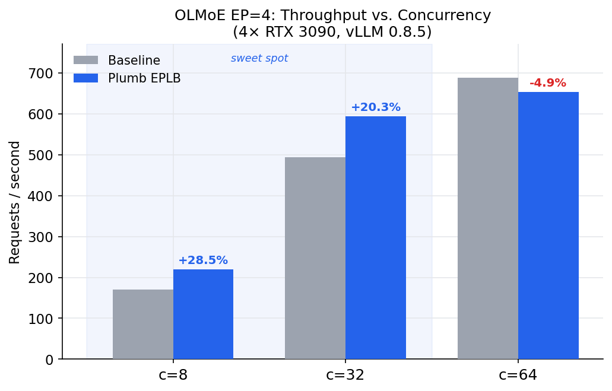
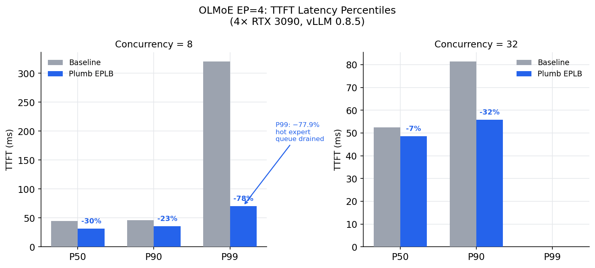

<div align="center">


# plumb

[](https://pypi.org/project/plumb-moe/)
[](https://pypi.org/project/plumb-moe/)
[](LICENSE)
[](bench/results/TEST_REPORT.md)
[](https://discord.gg/6sjAjwnNK)

**MoE inference profiler for vLLM and HuggingFace Transformers.** Measures expert activation imbalance, cross-NUMA dispatch inefficiency, and recommends topology-aware GPU placement. Zero code changes to the serving stack required.

</div>

```
pip install plumb-moe
```

---

## The problem

Mixture-of-experts models like DeepSeek V3 and Mixtral route each token to a small subset of experts. In production, routing is rarely uniform: a handful of experts receive the majority of tokens while others sit idle. Without instrumentation, operators have no visibility into this skew and no basis for deciding whether expert-parallel load balancing (EPLB) will help or hurt on their workload.

plumb provides that visibility.

---

## What it measures

- **Per-expert activation frequency** — every forward pass, per layer, per expert
- **Load imbalance ratio** — `max(expert_load) / mean(expert_load)` per layer, rolling window
- **Cross-NUMA dispatch rate** — what fraction of expert calls cross NUMA domain boundaries
- **Placement recommendation**: frequency-weighted bin-packing assignment that minimises cross-NUMA hops

---

## Quickstart

### Profile a vLLM server

Wrap any inference command with no code changes needed:

```bash
plumb run -- vllm serve mistralai/Mixtral-8x7B-v0.1 --dtype int4
```

In a second terminal, watch live metrics:

```bash
plumb attach          # interactive picker if multiple sessions
```

Generate a full JSON report:

```bash
plumb report          # writes report.json
plumb report --open-dashboard  # also opens http://localhost:8080
```

### Profile existing code (Python API)

```python
from plumb import Session

with Session(model, model_name="Mixtral-8x7B") as session:
    # ... run inference ...
    pass

report = session.report()
print(report.summary())
```

### Detect running models

```bash
plumb detect
```

---

## Benchmark results

Measured on 4x RTX 3090 (Vast.ai), vLLM 0.8.5.post1. Full results: [`bench/results/REPORT_v2.md`](bench/results/REPORT_v2.md).

### Hook overhead (OLMoE, vLLM TP=2)



The profiling hot-path (router logit extraction plus async ring-buffer push) adds zero measurable latency. Profiling can run in production without penalty.

| | Hooks ON | Hooks OFF | Delta |
|--|----------|-----------|-------|
| Mean TTFT | 38.59 ms | 38.68 ms | -0.09 ms |
| p=0.786 | 95% CI [-4.0, +3.8 ms] | | |

### EPLB throughput gains depend on concurrency



At moderate concurrency (c=8 to c=32), EPLB delivers 20-28% throughput gains on OLMoE with 6.74x expert imbalance. At full saturation (c=64), all GPUs are maxed out and the routing overhead flips the sign.

### Latency percentile improvements



The biggest gains show up in tail latency. At c=8, P99 drops from 320 ms to 71 ms (-77.9%) because the single hot expert cluster no longer queues tokens on one GPU.

### EPLB benefit depends on imbalance level

| Model | Peak imbalance | EPLB result at c=8 |
|-------|---------------|---------------------|
| OLMoE-1B-7B | **6.74x** | **+57.3% throughput, -29.9% p50** |
| DeepSeek-V2-Lite | 1.5x | ~0% — EPLB overhead dominates |

plumb's placement engine gates EPLB automatically. When peak imbalance is below 3x, it returns `method=none` with an explanation rather than recommending a rebalance that would hurt performance.

---

## Output

`plumb report` writes a JSON file with:

- Per-expert activation frequency (all layers)
- Load imbalance ratio per layer (`max_load / mean_load`)
- Cross-NUMA dispatch rate
- Topology-aware placement recommendation (greedy or [DeepSeek EPLB](https://github.com/deepseek-ai/EPLB))
- EPLB benefit gate: returns `method=none` when peak imbalance < 3x

```json
{
  "model_name": "Mixtral-8x7B",
  "hardware_config": "node01, NVIDIA H100 SXM x8",
  "profiling_duration_seconds": 300.0,
  "total_forward_passes": 18420,
  "layers": [
    {
      "layer_id": 0,
      "imbalance_ratio": 2.14,
      "max_expert_id": 3,
      "cross_numa_rate": 0.42,
      "experts": [...]
    }
  ],
  "placement": {
    "method": "greedy",
    "expert_placement": {"0:3": 0, "0:1": 1}
  }
}
```

---

## How it works

plumb uses Python's `sitecustomize` mechanism to inject a thin hook before the target process starts. The hook patches the forward pass of every MoE router in the model, recording `(layer_id, expert_id, token_count)` with sub-millisecond overhead per pass.

The placement engine reads the resulting activation histogram alongside the machine's NUMA topology (discovered from sysfs) and produces a recommended expert-to-GPU assignment using frequency-weighted bin packing, NUMA-domain-first.

No model weights, activations, or inference outputs leave the machine. Only routing decisions are recorded.

---

## Supported models

| Model | Backend |
|-------|---------|
| Mixtral 8x7B / 8x22B | vLLM, Transformers |
| DeepSeek-V2 / V3 | vLLM |
| OLMoE | Transformers |
| Qwen2-MoE / Qwen3-MoE | Transformers |

Other MoE models: add the class name to `_BLOCK_EXTRACTORS` in `plumb/hook.py` and open a PR.

---

## Test suite

```bash
pip install -e ".[dev]"
pytest tests/
```

**182 tests**, ~40 s, Python 3.13, CPU only (torch for GPU tests optional).

Verified on RTX 3070 (8 GB), Python 3.13, torch 2.11+cu128. See [`bench/results/TEST_REPORT.md`](bench/results/TEST_REPORT.md) for full coverage mapping.

```bash
# End-to-end smoke test (any machine)
python smoke_test.py
```

---

## Optional: DeepSeek EPLB placement

For optimal expert placement on large clusters, install the DeepSeek EPLB solver:

```bash
pip install git+https://github.com/deepseek-ai/EPLB.git
```

When EPLB is available, `recommend_placement` uses it instead of the built-in greedy algorithm.

---

## Requirements

- Python 3.10+
- PyTorch 2.0+ (optional for CPU-only analysis)
- vLLM 0.8+ (for vLLM instrumentation)

---

## Contributing

Bug reports and pull requests are welcome. The core profiling engine is open-source under Apache 2.0 and will remain so permanently.

Join the community on **[Discord](https://discord.gg/6sjAjwnNK)**.

---

## Licence

Apache 2.0 — see [LICENSE](LICENSE).
