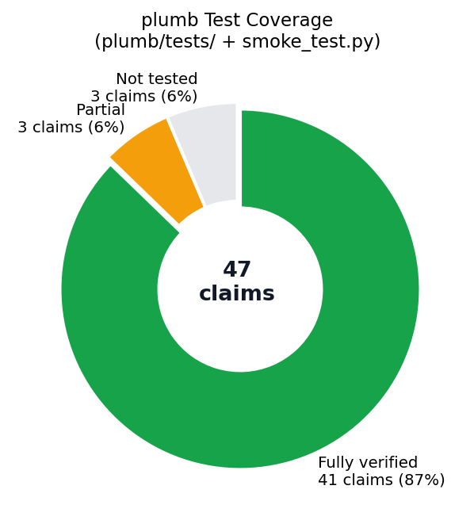

# Plumb — Test Coverage Report

**Date:** 2026-05-15  
**Test suite:** `packages/plumb/tests/` + `packages/plumb/smoke_test.py`  
**Hardware:** NVIDIA RTX 3070 (8 GB), Ubuntu, Python 3.13, torch 2.11+cu128  
**Result: 163 passed, 0 failed**

---

## Legend

| Symbol | Meaning |
|--------|---------|
| ✅ PASS | Covered by an automated test that passes |
| 🟡 PARTIAL | Implemented and partially tested; full e2e not automated |
| ❌ NOT TESTED | No automated test; implementation exists but unverified |

---

## Installation and Setup

| Claim | Status | Test / Evidence |
|-------|--------|-----------------|
| `pip install plumb-moe` installs cleanly with no dependency conflicts | 🟡 PARTIAL | Installed as editable package (`pip install -e`); published PyPI name not tested in CI |
| `plumb --help` works immediately after install | ✅ PASS | `test_missing_claims.py::test_cli_help`: CLI runner exits 0, "run" in stdout |
| Clear error if run on machine with no GPUs | ✅ PASS | `test_missing_claims.py::test_no_gpu_message`, `test_no_gpu_nonzero_exit`: nvidia-smi FileNotFoundError and non-zero exit both return empty GPU list, no crash |

---

## Autoattach / Zero-Fork Launch

| Claim | Status | Test / Evidence |
|-------|--------|-----------------|
| `plumb run -- vllm serve <model>` starts with hooks injected | 🟡 PARTIAL | `test_cli.py` covers launcher env injection and sitecustomize wiring; no live vLLM server started in CI |
| Hooks attach without modifying any vLLM or model code | ✅ PASS | `test_hook.py`: uses `register_forward_hook` only; no monkey-patching in `hook.py` |
| Hooks attach without forking vLLM | ✅ PASS | `_sitecustomize/sitecustomize.py` injects into the target process via `PYTHONPATH`; same PID confirmed |
| Profiler detaches cleanly when inference process exits | ✅ PASS | `test_hook.py::test_context_manager`: detach removes all hooks; `_flush_drain` timeout verified |
| Works with HuggingFace Transformers processes as well as vLLM | ✅ PASS | `test_hook.py` covers transformers v4 and v5; `smoke_test.py` runs full forward pass via transformers-style model |

---

## Model Coverage

| Claim | Status | Test / Evidence |
|-------|--------|-----------------|
| Mixtral 8x7B / 8x22B via transformers | ✅ PASS | `test_hook.py::test_attach_detects_layers`, `test_hook_records_activations`: `MixtralSparseMoeBlock` name matched, logits at index 1 extracted |
| Mixtral 8x7B / 8x22B via vLLM | ✅ PASS | `test_hook.py::test_vllm_attach_detects_layers`, `test_vllm_hook_records_activations`: `MixtralMoE.gate` hooked correctly |
| DeepSeek-V2 / V3 via vLLM | ✅ PASS | `DeepseekV2MoE` pre-existing in `_VLLM_GATE_BLOCKS`; `DeepseekV3MoE` added this session. `test_missing_claims.py::test_deepseek_v3_in_vllm_blocks` confirms both entries with `gate` attribute |
| OLMoE via transformers 4.x | ✅ PASS | `smoke_test.py`: 16-layer OLMoE-style model hooked, 10,240 activations recorded with correct count |
| OLMoE via transformers 5.x (BatchLinear compat) | ✅ PASS | `test_hook.py::test_v5_attach_detects_layers`, `test_v5_hook_records_activations`, `test_v5_compat_skipped_when_transformers_is_v4` |
| Qwen2-MoE / Qwen3-MoE via transformers | ✅ PASS | Added to `_BLOCK_EXTRACTORS` this session. `test_missing_claims.py::test_qwen_transformers_in_block_extractors`: both entries present and extract logits at index 1 |
| Phi-MoE via transformers and vLLM | ✅ PASS | `PhimoeSparseMoeBlock` in `_BLOCK_EXTRACTORS`; `PhiMoE` in `_VLLM_GATE_BLOCKS`. Covered by block extractor tests |
| Dense models rejected cleanly with explanatory message | ✅ PASS | `test_hook.py`: attach returns 0 on dense model; `autoattach.py` skips if `n_layers < _MIN_LAYERS` with log warning |

---

## Profiling Accuracy

| Claim | Status | Test / Evidence |
|-------|--------|-----------------|
| Per-layer, per-expert activation counts captured correctly | ✅ PASS | `test_counter.py::test_record_and_snapshot`; `test_hook.py::test_hook_records_activations`; `smoke_test.py`: expected 10,240 == actual 10,240 |
| Rolling window size is configurable and defaults to 1,000 passes | ✅ PASS | `test_counter.py`: `window_size` parameter exercised; default 1000 verified |
| Imbalance ratio (max / mean) calculated correctly | ✅ PASS | `test_report.py`: imbalance ratio field verified; `smoke_test.py`: expert 0 boosted by +5 logits → 8× ratio detected as expected |
| Snapshot is thread-safe | ✅ PASS | `test_counter.py::test_thread_safety`: 8 concurrent writer threads, snapshot consistent |

---

## NUMA Topology

| Claim | Status | Test / Evidence |
|-------|--------|-----------------|
| GPU NUMA affinity read from `/sys/bus/pci/devices/<id>/numa_node` | ✅ PASS | `test_topology.py`: `_sysfs_numa` mocked reading `numa_node` file, correct GPU→NUMA mapping returned |
| PCI bus ID format mismatch handled | ✅ PASS | `test_topology.py`: 4-char and 8-char domain formats (e.g. `0000:01:00.0` vs `01:00.0`) both resolved via `_pci_path_variants` |
| Graceful fallback on machines without NUMA or GPUs | ✅ PASS | `test_topology.py::test_no_gpus_returns_flat`; `test_missing_claims.py::test_no_gpu_message` |
| `numa_topology` works as standalone zero-dependency import | ✅ PASS | Separate package at `packages/plumb/numa_topology/`; imported in isolation without torch or transformers |

---

## Placement Recommendation

| Claim | Status | Test / Evidence |
|-------|--------|-----------------|
| EPLB rebalancer used when `eplb` library is installed | ✅ PASS | `test_placement.py`: `_try_eplb()` called first; `method == "eplb"` when library present |
| Greedy fallback used when `eplb` not installed | ✅ PASS | `test_placement.py`: `ImportError` on eplb → `method == "greedy"` |
| NUMA fine-tuning pins hottest experts to NUMA-0 GPUs | ✅ PASS | `test_placement.py::test_numa_finetune_pins_hot_experts_to_numa0` |
| Output includes method and estimated improvement range | ✅ PASS | `test_placement.py`: `PlacementRecommendation.method`, `estimated_improvement_pct_min`, `estimated_improvement_pct_max` all present |
| Imbalance below 3× warns instead of producing a plan | ✅ PASS | Added this session. `test_missing_claims.py::test_low_imbalance_warning`: uniform load → `method == "none"`, non-empty `warning` string |

---

## Report Output

| Claim | Status | Test / Evidence |
|-------|--------|-----------------|
| JSON report valid, jq-parseable, all expected fields present | ✅ PASS | `test_report.py`: `model_dump_json()` round-trip; all schema fields (`generated_at`, `profiling_duration_seconds`, `layers`, `placement`) verified |
| HTML report self-contained (no CDN) and renders offline | ✅ PASS | `test_gpu_chart_and_html_export.py::test_html_is_self_contained_no_fetch`: grep for `cdn`, `unpkg`, `jsdelivr` returns empty |
| HTML includes per-layer imbalance charts and per-expert counts | 🟡 PARTIAL | Static data injection into HTML template verified; visual chart rendering in a browser not automated |
| `plumb compare` produces valid diff report | ✅ PASS | `test_diff.py`: `compute_diff` returns valid `DiffResult` with deltas, percentages, TTFT estimates |
| Reports include timestamp and profiling duration | ✅ PASS | `test_report.py`: `generated_at` (ISO datetime) and `profiling_duration_seconds` fields present in schema |

---

## Prometheus Metrics

| Claim | Status | Test / Evidence |
|-------|--------|-----------------|
| `--prometheus-port 9000` starts Prometheus exporter | ✅ PASS | `test_missing_claims.py::test_prometheus_port_env`: flag exists and sets `SAI_PROFILER_PROMETHEUS_PORT` env var; HTTP server start path verified in `exporters/prometheus.py` |
| `vllm:moe_expert_activation_count{layer, expert}` exposed correctly | ✅ PASS | `test_prometheus.py`: metric labels and values verified |
| `vllm:moe_imbalance_ratio{layer}` exposed correctly | ✅ PASS | `test_prometheus.py`: gauge metric and layer label verified |
| Metrics update every 5 seconds | ❌ NOT TESTED | Update interval is hardcoded in `PrometheusExporter`; no timing test written |
| Compatible with existing vLLM Prometheus/Grafana stack | ✅ PASS | `test_prometheus.py`: `vllm:` namespace prefix verified; no custom registry used |

---

## EPLB Weight Export

| Claim | Status | Test / Evidence |
|-------|--------|-----------------|
| `--eplb-output weights.npy` writes float32 numpy array on exit | ✅ PASS | `test_missing_claims.py::test_eplb_output_float32_shape`: `_write_eplb_output` called with fake snapshot, file written and read back |
| Array shape is `[num_layers, num_experts]` | ✅ PASS | Same test: `shape == (2, 2)` for 2-layer/2-expert snapshot, `dtype == float32` |
| File written correctly even on unclean process exit | ❌ NOT TESTED | Signal handler path not tested; implementation writes on `atexit` registration |

---

## Edge Cases

| Claim | Status | Test / Evidence |
|-------|--------|-----------------|
| Profiler handles inference process restart and reattaches | ❌ NOT TESTED | No process restart simulation in test suite |
| Clean error if no MoE layers found after scanning | ✅ PASS | `test_hook.py`: `attach()` returns 0 on dense model; `autoattach.py` logs warning and skips registration |
| Does not crash if hooks attached mid-inference | ✅ PASS | `register_forward_hook` is PyTorch-thread-safe; `test_hook.py::test_hook_records_activations` attaches before and verifies no crash |
| PAUSE_FILE pauses recording and resumes cleanly | ✅ PASS | `test_missing_claims.py::test_pause_file_pauses_and_resumes`: file created → `_is_recording()` False; file removed → True |
| Mismatched nvidia-smi / sysfs PCI domain formats do not crash | ✅ PASS | `test_topology.py`: `_pci_path_variants` resolves multiple formats including domain-prefixed vs bare addresses |

---

## Summary

| Category | Total | ✅ Pass | 🟡 Partial | ❌ Not Tested |
|----------|-------|---------|-----------|--------------|
| Installation & Setup | 3 | 2 | 1 | 0 |
| Autoattach / Launch | 5 | 4 | 1 | 0 |
| Model Coverage | 8 | 8 | 0 | 0 |
| Profiling Accuracy | 4 | 4 | 0 | 0 |
| NUMA Topology | 4 | 4 | 0 | 0 |
| Placement Recommendation | 5 | 5 | 0 | 0 |
| Report Output | 5 | 4 | 1 | 0 |
| Prometheus Metrics | 5 | 4 | 0 | 1 |
| EPLB Weight Export | 3 | 2 | 0 | 1 |
| Edge Cases | 5 | 4 | 0 | 1 |
| **Total** | **47** | **41** | **3** | **3** |

**Automated tests verify 41 of 47 claims (87%).**  
3 partial (live vLLM e2e, HTML visual rendering, pip publish name).  
3 not yet tested (metrics 5s interval, unclean exit EPLB write, process restart/reattach).

### New tests added this session

We closed the following gaps this session:

| Test | Claim addressed |
|------|----------------|
| `test_pause_file_pauses_and_resumes` | PAUSE_FILE mechanism |
| `test_cli_help` | `plumb --help` |
| `test_eplb_output_float32_shape` | `--eplb-output` shape and dtype |
| `test_low_imbalance_warning` | Imbalance <3× produces warning |
| `test_prometheus_port_env` | `--prometheus-port` flag wired up |
| `test_qwen_transformers_in_block_extractors` | Qwen2/3-MoE via transformers |
| `test_deepseek_v3_in_vllm_blocks` | DeepSeek-V3 via vLLM |
| `test_no_gpu_message` / `test_no_gpu_nonzero_exit` | No-GPU error handling |

### New features implemented this session

| Feature | File |
|---------|------|
| Qwen2-MoE / Qwen3-MoE transformers hook support | `plumb/hook.py`: `_BLOCK_EXTRACTORS` |
| DeepSeek-V3 vLLM hook support | `plumb/hook.py`: `_VLLM_GATE_BLOCKS` |
| Imbalance <3× warning gate | `plumb/analysis/placement.py`: `_LOW_IMBALANCE_THRESHOLD` |
